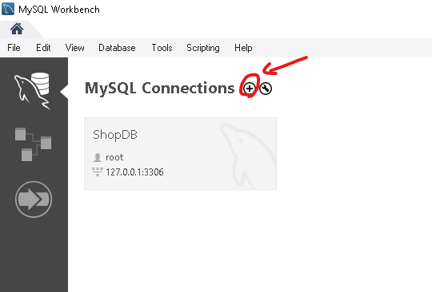
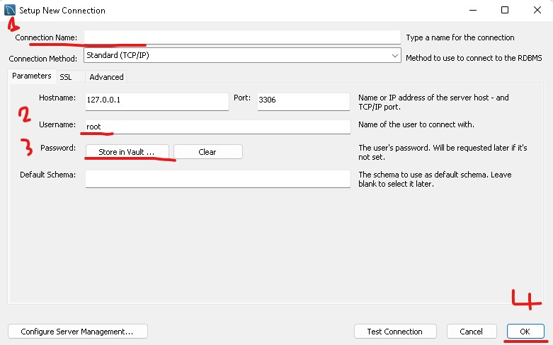
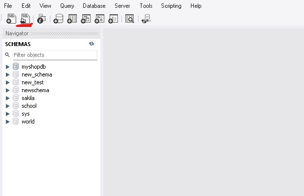
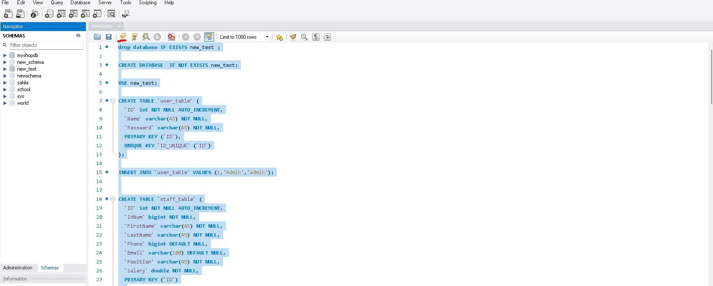
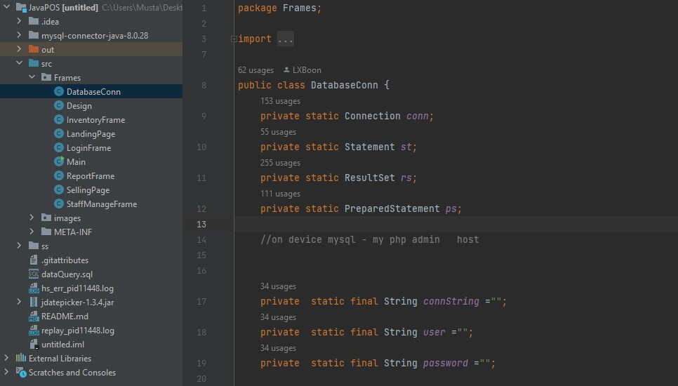
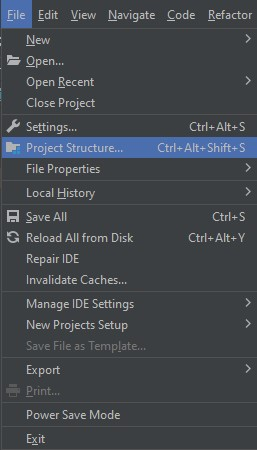
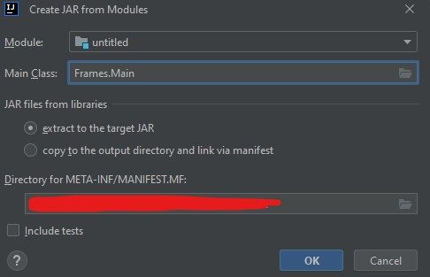
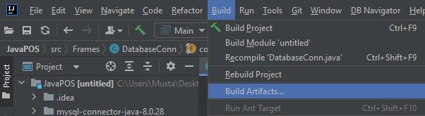
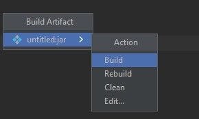

# How to use 
 

## Download java and install
 
- https://www.java.com/en/download/manual.jsp
 

## Download jdk-17 and install

 
- https://www.oracle.com/java/technologies/javase/jdk17-archive-downloads.html
 

## Download and setup MYSQL Workbench and install
 
- You can watch tutorials in YouTube  to do it Step by step, if you don't know how to. 
 
- https://dev.mysql.com/downloads/
 

## Download intellij idea and install
 
- https://www.jetbrains.com/idea/download/#section=windows
 

## How to Set Up Data Base

Open MYSQL Workbench
 
    - clik the + sign     
     

    1- Enter a connection name
    2- Enter User Name
    3- Enter Password
    4- Click ok

Open the Connection by Clicking it

    - click add a SQL script file in a new query tab
    - navigate to dataQuery.sql in project file and open

To Change database name

    - change all instances of myshopdb to a new name
    - name must not contain spaces
    
Deafult Login Name and Password 

    - Deafult Login name is : "Admin" 
    - Deafult Login Password is : "admin";
    
Costum Login Name and Password
    
    Change line 15 from INSERT INTO `user_table` VALUES (1,'Admin','admin');
    To : INSERT INTO `user_table` VALUES (1,'insert user name here','insert password here');

IF all costumizations are done

    - select all text by ctl + A
    - click execute

 

## connect to database in the code source

    - open untitled.iml in intellij idea
    - intellij idea will give you a small pop-up messages to download necessary items
    - After Downloading them all

Open src/Frames/DatabaseConn
 

 
    
    -To connect to your database, you need to change lines 17,18,19
    connString example:
    jdbc:mysql://localhost:3306/databaseName

 
    
## Make a runable program anywhere at your pc

    - Open File>Project Structure

    
    - In the menue Project Settings select Artifacts and click the plus sign JAR>From modules with dependencies
    

    - In main class Chose Frames.Main
    - Chose where to save
    - click ok
    - click apply and ok
    
On the menue bar chose Build > Builed Artifact

Click Build 

Now go to where you saved the artifact and can run it from your pc, if you host the database online,
you can access the program and your own database from any pc
    

